# c606-oss — open firmware for the Magene C606 / C706 (proof of concept)

The Magene C606 bike computer is an **ESP32-S3** driving a 240x320 ST7789 over
a 16-bit i80 bus, plus an **nRF co-processor** that owns the buttons, power
management and sensor radios and talks to the ESP32 over UART. The **C706**
is the same design with a 320x480 AXS15231 panel on an 8-bit bus, 32 MB
flash, 8 MB PSRAM and five keys (`BOARD=c706`); the **C606 Pro** is the C606
with the C706's 8-bit display bus and octal PSRAM (`BOARD=c606pro`, built
from its firmware, not yet tried on a unit). See *Targets* below.

This PoC replaces only the ESP32 application. It:

* initialises the LCD with the vendor's exact init sequence and turns on the backlight,
* runs **LVGL 9** (draw buffers in internal DMA RAM, objects in the 2 MB PSRAM),
* opens the UART link to the nRF, sends the vendor's power-on handshake,
* decodes button, battery, temperature/pressure and version frames,
* reads the Airoha AG3352Q GNSS on UART0 (auto-baud, NMEA RMC/GGA/GSV),
* mounts the on-board 4 GB eMMC (FAT, `/sdcard`) and records rides as standard
  **FIT activity files** in `/sdcard/c606oss/` (Strava, Garmin Connect, Golden
  Cheetah, … import them directly),
* exposes the eMMC over USB as a mass-storage disk on demand,
* touchscreen (FT6336 over I2C) as an LVGL pointer: on-screen REC / USB buttons,
* ANT+ sensors through the nRF: HR, speed, cadence, power decoded. The paired
  list lives in our own config (the vendor's `CONFIG/sensor_list.json` is imported
  once on first run); Settings → Sensors lists them with their live state,
  forgets them, adds new ones through an ANT scan, and sets the wheel
  circumference,
* session statistics (current / min / max / avg) for every measured parameter —
  GPS speed and altitude, HR, cadence, sensor speed, power, temperature,
  pressure, battery,
* up to 5 user-configurable data pages, Bryton/Magene style: each page has
  one of 18 cell layouts ("fences" 1, 2, 3A … 12) and every cell shows one
  data field (Speed, Max Speed, Avg HR, Time of Day, …). Configured on the
  device in the settings menu (gear icon), saved in NVS,
* **sunrise / sunset** (`main/sun.c`, NOAA equations) for the day and the
  last GPS position — *Sunrise*, *Sunset* and *Sunset in* (h:mm countdown)
  data fields for any cell, a line on the idle screen, and an *Auto theme*
  setting that uses the light theme by day and the dark one after sunset.
  The position is remembered in NVS, so the times are there right after
  power-on, before the receiver has a fix,
* **map page**: reads the vendor's vector maps (`MAP/*.map` on the eMMC —
  plain Mapsforge binary files, see `docs/HARDWARE.md`) and draws the roads
  around the GPS position; +/− zoom buttons (zoom 10–17), scale bar, light
  and dark palettes following the theme, rendered in its own task in well
  under 100 ms per view. Configured like the data pages (Settings → Pages →
  Map): enable, layout *Map* (map only), *M1* / *M2* (one or two data fields
  in a strip under the map, Speed + Heading by default), fields per cell,
* **GPX routes**: copy `.gpx` tracks/routes to `c606oss/routes/` on the USB
  disk, pick one in Settings → Route — a preview shows the track outline,
  length, climb / descent (from `<ele>`, when present) and a *Reverse*
  toggle before it is loaded — and it is drawn on the map (magenta, green
  start / red end) and a *Route Left* data field counts down the track
  distance to its end; the map page works with a route even without a map
  file,
* **ride history**: Settings → History lists the recorded rides (ours in
  `c606oss/`, and the vendor firmware's in `FITS/FIT/`, tagged *Magene*)
  newest first; a ride opens with its track outline and the summary — time,
  distance, avg / max speed, avg / max HR, cadence, power, calories, climb /
  descent, laps (`main/fitread.c`, a small tolerant FIT reader) — and can be
  *used as route*: it becomes the map's route like a GPX file, or deleted,
* developer console on the USB port: inject key/touch events and take
  screenshots from the host (`tools/devcon.py`),
* idle / riding / paused modes: the idle screen (clock, GPS and sensor state,
  START button) is shown until a ride is started; the data pages, the track
  recording and the statistics only run during a ride,
* keys: 0 = next page (idle ↔ status ↔ map when idle; the data pages and
  the map during a ride), 1 = manual lap, 2 = start ride / pause / resume,
  hold 2 = "End ride?" dialog, hold 0 = power-off popup. USB storage mode is
  in Settings → System (tap *Reboot* or hold key 1 to leave it).

Everything hardware-specific lives in `main/board_c606.h` /
`main/board_c706.h` (selected by `main/board.h` through the Kconfig choice
`C606OSS_BOARD`); the analysis behind it is in
[`docs/HARDWARE.md`](docs/HARDWARE.md).

## Screenshots

Taken on the device with `tools/devcon.py … shot` (240x320).

| Idle | Status | Data page | Map |
|:--:|:--:|:--:|:--:|
| 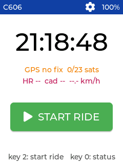 | 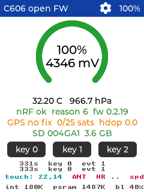 | 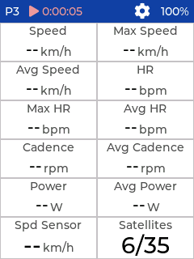 | 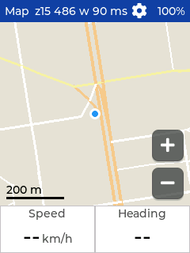 |

| Ride: page 2 | Map while riding | Lap | End ride? | Summary |
|:--:|:--:|:--:|:--:|:--:|
| 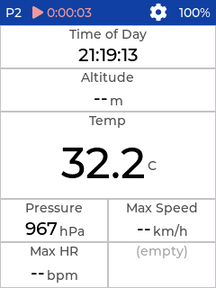 | 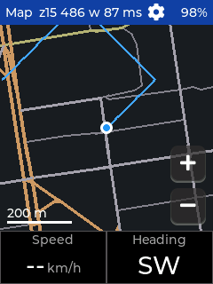 | 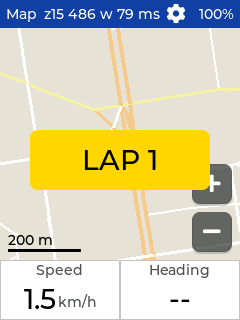 | 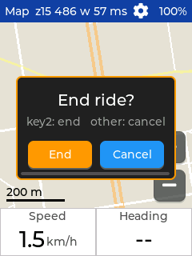 | 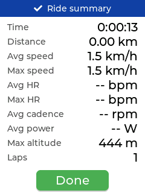 |

Dark theme (default):

| Idle | Status | Map z15 | Map z12 |
|:--:|:--:|:--:|:--:|
| 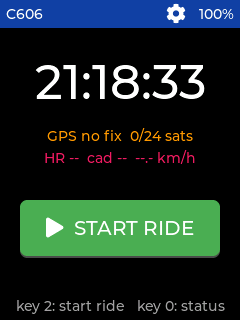 | 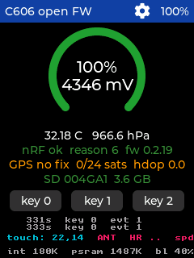 | 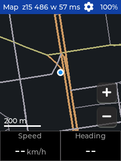 | 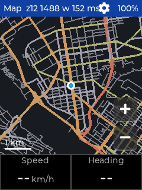 |

Settings:

| Settings | Pages | Page | Layout picker | Field editor |
|:--:|:--:|:--:|:--:|:--:|
| 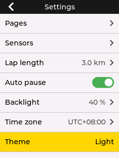 | 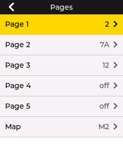 | 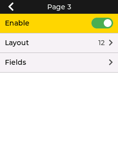 | 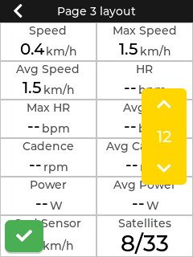 | 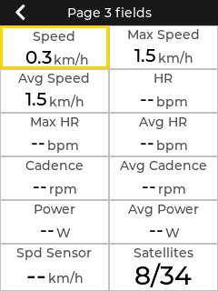 |

| Categories | Field list | Map page | Map layout | Map layers |
|:--:|:--:|:--:|:--:|:--:|
| 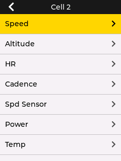 | 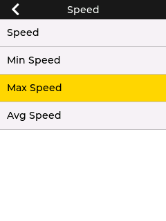 | 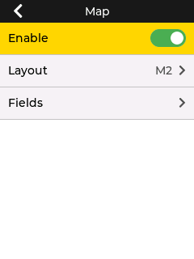 | 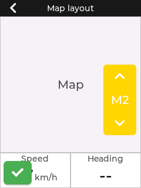 | 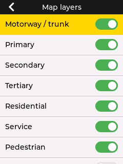 |

| Sensors | System | Settings (dark) |
|:--:|:--:|:--:|
| 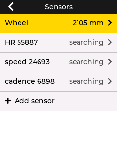 | 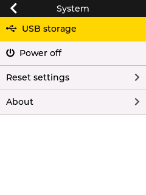 | 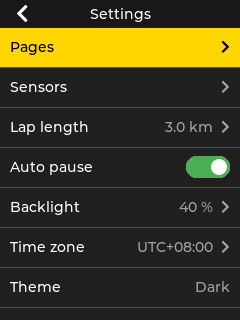 |

## Build

Needs ESP-IDF **5.3 or newer** (`esp_driver_uart`, `esp_lcd` i80 API) and
network access on first build (LVGL comes from the component registry, see
`main/idf_component.yml`).

```sh
. $IDF_PATH/export.sh
idf.py set-target esp32s3
idf.py build
```

or without installing anything on the host:

```sh
tools/build_podman.sh          # uses docker.io/espressif/idf:v5.4.2
```

### Targets

| `BOARD` | device | build dir / image | differences |
|---|---|---|---|
| `c606` (default) | Magene C606 | `build/c606_oss.bin` | ST7789 240x320, 16-bit i80, 16 MB flash, 2 MB quad PSRAM, 3 keys |
| `c606pro` | Magene C606 Pro | `build-c606pro/c606pro_oss.bin` | as the C606 but ST7789 on the C706's 8-bit i80 pins (byte-swapped pixels, its own init sequence), octal PSRAM — untested on hardware |
| `c706` | Magene C706 | `build-c706/c706_oss.bin` | AXS15231 320x480, 8-bit i80 (pixels byte-swapped, 4-px aligned windows), panel reset through the nRF, backlight GPIO10, touch in the panel (0x3B), 32 MB flash, 8 MB octal PSRAM, 5 keys, GPS opened at 115200 |

```sh
BOARD=c706 tools/build_podman.sh                 # or: idf.py -B build-c706 -DBOARD=c706 build
BOARD=c706 tools/make_release.sh                 # c706-oss-<version>.zip
tools/flash_poc.py -p /dev/ttyACM0 --board c706  # picks build-c706/c706_oss.bin
```

`-DBOARD=<board>` adds `sdkconfig.defaults.<board>` (flash size, PSRAM mode,
partition table, the board choice) on top of `sdkconfig.defaults` and keeps
its own `sdkconfig.<board>`. The C706 keys follow the vendor's map: key 0
click = lap / hold = power off, key 2 = start / pause (hold = end ride),
key 3 / 4 = next / previous page; in the menus 0 = back, 2 = select,
3 / 4 = down / up. The analysis behind the port is in `docs/HARDWARE.md`,
section *Magene C706*; the build runs on a real C706 (display, touch, nRF,
keys, eMMC, GPS verified on 2026-09-19).

Console logs go to the S3's USB-Serial-JTAG (the USB-C port):
`idf.py -p /dev/ttyACM0 monitor`.

## Flash — without losing the vendor firmware

The bootloader, partition table, NVS (contains the phy calibration and the
vendor's device config) and the nRF are untouched. Only the `ota_0` app slot
is overwritten and `otadata` is erased so the bootloader boots `ota_0`.

```sh
# put the device into download mode (GPIO0 low at reset), then:
tools/flash_poc.py -p /dev/ttyACM0            # backs up ota_0 + otadata first (--full-backup for all 16 MB)
tools/flash_poc.py -p /dev/ttyACM0 --dry-run  # just show the partition table
```

To hand a build to someone else: `tools/make_release.sh` zips the binary,
the flash helper and [`docs/FLASHING.md`](docs/FLASHING.md) (short
instructions for the recipient: `pip install esptool`, run the helper).

Restore the vendor app:

```sh
tools/flash_poc.py -p /dev/ttyACM0 --restore path/to/vendor_ota_0.bin
```

(`vendor_ota_0.bin` = the `ota_0` partition dumped from your device, e.g.
with `esp32_image_parser.py dump_partition`.)

## What to expect on boot (verified on hardware)

1. Idle screen: clock (nRF RTC + time zone), GPS fix / satellites, paired
   sensor values, today's sunrise / sunset and a *START RIDE* button. Key 0 switches to the
   status page (battery arc with mV, temperature and pressure, `nRF ok reason 4
   fw 0.2.19`, GPS and eMMC state, three key boxes, event log, heap footer) and
   back. A key box flashes green on a click and stays red while long-pressed.
2. Key 2 (or *START RIDE*) starts a ride: statistics are reset, a FIT file is
   opened in `/sdcard/c606oss/<local date-time>.fit` (`main/tracklog.c` on top
   of the small encoder in `main/fit.c`: `file_id`, `file_creator`,
   `device_info` for the unit and the paired ANT+ sensors, timer start/stop
   events around pauses, one `record` per second with position, altitude,
   distance, speed — wheel sensor if live, else GPS —, HR, cadence, power and
   temperature, a `lap` per lap with its averages/maxima, then `session` and
   `activity`; fields without data carry the FIT "invalid" value) and the
   data pages appear ("Page 1" … "Page 5", only the enabled ones; key 0
   cycles). The header shows `▶ h:mm:ss` (session time). Key 2 pauses (`‖`,
   recording and statistics stand still, the time excludes pauses) and resumes.
   Hold key 2 for the *End ride?* dialog: key 2 / *End* closes the track file
   and shows the ride summary (time, distance, avg/max speed, avg/max HR, avg
   cadence and power, max altitude, laps); any key or *Done* returns to the
   idle screen, anything else in the dialog cancels. The file only opens once
   the clock is known (nRF RTC, else the GPS date — after 20 s without either
   it records anyway, timestamped from 2000-01-01). With *Auto pause*
   on, standing still (below 1.5 km/h for 3 s, wheel sensor or GPS) pauses the
   ride by itself (`‖ … auto`) and moving again (> 3 km/h) resumes it; a manual
   pause is never auto-resumed.
3. Data page cells show a field's name and value (font sized to the cell;
   grey `--` when no fresh reading arrived within a few seconds). Fields are
   the current / min / max / avg of every measured parameter, distance and
   laps (Distance, Laps, Lap Dist, Lap Time, Lap Speed, PreLap Time, PreLap
   Dist), *Route Left* (km along the loaded GPX route from the nearest point
   of the track to its end, see *Route* below; `--` without a route or a
   fix), time of day, session time, battery %, satellites, heading
   (compass point from the GPS course while moving), sunrise / sunset
   (local HH:MM for the current local date at the last GPS position, `24h` /
   `none` on polar days; `--:--` until both a position and the clock are
   known — the position is saved in NVS whenever it moves ~10 km from the
   saved one, so it survives power cycles) and *Sunset in* (h:mm left until
   today's sunset, `--` once the sun is down). Distance comes
   from the ANT+ wheel sensor when it is live (revs × `ANT_WHEEL_CIRC_M`),
   otherwise from consecutive GPS fixes (moving faster than 2 km/h); a lap
   ends automatically every *Lap length*; key 1 ends the current lap by hand
   (a "LAP n" toast confirms it). The average is time-weighted, so it
   does not depend on how often a sensor reports; cadence and HR ignore zero
   samples. *Reset statistics* in the menu restarts the session by hand.

   **Settings menu** — tap the gear icon in a page header. Touch or keys work
   (key 2 = up, key 1 = down, key 0 = select; selecting the back arrow goes
   back):
   * *Pages* → *Page n* → *Enable*, *Layout* (preview of the page with an
     up/down selector, tick applies), *Fields* (preview of the page: tap a cell,
     or move the yellow frame with the keys and press key 0, then pick a
     category and a field). The last entry, *Map*, configures the map page
     the same way with the layouts *Map* / *M1* / *M2*.
   * *Sensors* → *Wheel* (circumference in mm, +/− screen, hold to run) and
     the known ANT+ sensors with their state (`ok` / `searching` / `--`); tap
     one to *Forget* it, *Add sensor* runs a 30 s ANT scan and lists what it
     finds with RSSI — tap a result to pair and connect it.
   * *Lap length*: +/− screen, 0.5 km steps, 0 = off (touch the buttons or
     key 2 / key 1, hold to run, key 0 goes back; the value is saved when
     leaving the screen).
   * *Auto pause* on/off.
   * *Backlight*: +/− screen, 10 % steps, applied live and remembered.
   * *Time zone*: same +/− screen in 30 min steps (UTC-12 … UTC+14) for the
     time of day, which comes from the nRF's RTC (UTC), GPS as fallback.
   * *Theme*: dark (default) or light, applied immediately (`main/theme.c`:
     shared LVGL styles; status colours are darkened on the light background).
   * *Auto theme*: light between sunrise and sunset, dark otherwise, checked
     twice a second from the sun times above (so it also follows the clock
     and time zone). Applied at once when switched on; picking a theme by
     hand switches it off again.
   * *Map layers*: a toggle per road class (motorway/trunk, primary, …,
     track, cycleway), water, coastline and "other" — switched-off layers
     are skipped before their coordinates are even decoded, so a
     roads-only map renders a little faster, never slower.
   * *Route*: one of the `.gpx` files in `/sdcard/c606oss/routes/` (the
     loaded one is ticked, "rev." when reversed; the settings row shows its length) or
     the first row — *None*, which becomes *Unload route* while a route is
     loaded — to take the track off the map. Picking a file opens a preview:
     the track outline with start (green) / end (red) markers, length and
     point count, total climb / descent with the elevation range when the
     points carry `<ele>` (a 5 m hysteresis keeps GPS noise from adding up;
     "No elevation data" otherwise), a *Reverse* toggle (ride the track from
     its end — swaps the markers and the climb / descent) and *Use this
     route*. `main/route.c` scans the file for `<trkpt>` / `<rtept>` lat/lon
     attributes and their `<ele>` child, so GPX 1.0/1.1 tracks and routes
     from any tool work; points are kept as Web-Mercator pixels in PSRAM
     (long tracks are thinned to 16k points, the preview to 512), the
     choice and the direction persist in the config. Every GPS fix is
     matched to the nearest point of the loaded track for the *Route Left*
     field; the match prefers the stretch it was on last time, so an
     out-and-back track does not flip to the other leg where both run along
     the same road.
   * *History*: the recorded rides, newest first (the date and time from
     the file name, so the list is instant; the ride being recorded is not
     listed; rides recorded by the vendor firmware — `FITS/FIT/<unix
     time>.fit` on the card — are included and tagged *Magene*). A ride
     opens with its track outline ("No GPS track" for an indoor ride) and a
     3 × 4 summary: timer time, distance, avg / max speed, avg / max HR,
     cadence, power, calories, climb / descent and laps. The values come
     from the file's `session` message; a file without one (power lost
     mid-ride, or the vendor's files, which end with a single `lap` instead)
     gets them from that lap or, failing that, from the records
     themselves. *Use as route* makes the ride the map's route (a `.fit`
     name in the *Route* setting, listed on top of the GPX files there) and
     *Delete ride* removes the file after a confirmation.
   * *Reset statistics*.
   * *System* → *USB storage*, *Power off*, *Reset settings* (with a
     confirmation: everything back to the firmware defaults), *About*.
   The configuration lives in the NVS partition, namespace `c606oss` (the
   vendor's entries are untouched); defaults are in `config_defaults()`.
   New settings are appended to `app_cfg_t`; older blobs are upgraded in
   place (`k_len_by_version` in `config.c` lists each version's blob size,
   padding included — the static assert reminds you to extend it).
   Layouts are the table in `main/layouts.c`.

4. Settings → System → USB storage: the eMMC appears on the host as a 3.7 GB
   USB disk (`303a:4002 c606-oss C606 eMMC`, auto-mounted by most desktops).
   The S3 has a single USB PHY, so the console and esptool auto-reset are gone
   while in this mode — eject the disk, then tap *Reboot* or hold key 1.
5. Hold key 0: "Power off?" popup — key 0 again (or tap Off) powers off via
   the nRF, any other key (or Cancel, or 8 s) dismisses it. Press key 0 to
   power on again.

**Temperature / pressure show `--.-` after flashing?** The nRF only streams
its IMU/baro data after the power key has been *held* (its power-on gesture).
An esptool or software reset skips that, so hold key 0 once and cancel the
popup; a normal button power-on doesn't need it.

**If the ESP32 is ever unreachable** (no USB device, screen frozen): hold all
three buttons for a few seconds — the nRF performs a hardware reset / power
cycle of the ESP32 regardless of what the firmware is doing.

Console: `tools/serial_log.py /dev/ttyACM0 20 --reset` (inside the IDF
container, or anywhere with pyserial) prints the boot log and every non-periodic
nRF frame.

Developer console (same port, `main/devcon.c`): `tools/devcon.py /dev/ttyACM0
key 0 1` clicks key 0, `... tap 120 160` touches the screen, `... shot out.png`
saves a screenshot, `... ls` lists the ride files and `... get
/sdcard/c606oss/<name>.fit` copies one to the host (no need for USB storage
mode), `... put local.gpx /sdcard/c606oss/routes/x.gpx` copies a file to the
card (e.g. a route), `... mv a b` renames a file on the card, `... pos 55.03 82.92` centres
the map page on a position without a GPS fix (`pos` alone: back to the GPS),
`... zoom 13` sets the map zoom, `... sim 55.03 82.92 45 30 60` simulates a
GPS receiver riding from that position on heading 45° at 30 km/h for 60 s
(real RMC/GGA sentences through the real parser; `... nmea off` hands the
GPS back to the receiver), and `... script "key 0 1" "sleep 0.5" "shot
a.png"` chains them (the device log keeps printing during `sleep`). Useful for
exercising the UI without touching the device.

**Maps.** The map page lists `/sdcard/MAP/*.map` at boot (the vendor's
Mapsforge files; the encrypted `.etu` files are ignored). Without a `.map`
file the page is not in the key-0 ring. Vendor maps for other regions are
produced with the mapsforge map-writer, so any Mapsforge v3 map works —
`tools/mapdump/` builds the same reader on the host (`build.sh`, then
`mapdump file.map lat lon zoom out.ppm`) for checking a file without the
device. File names containing "china" are treated as GCJ-02 (the fix is
shifted to match); the Siberia map is plain WGS-84 despite its "mars_"
prefix.

If the screen stays dark: check the backlight (GPIO45) first — the bars are
drawn before it is enabled, so a dark-but-flickering panel means the i80 bus
works. If colours are swapped (red <-> blue) build with
`-DLCD_MADCTL=0x08` (BGR bit) in `main/CMakeLists.txt`.

## Known unknowns / risks

* The USB PHY mux (`RTCCNTL.usb_conf.sw_usb_phy_sel`) survives software
  resets. The firmware puts it back to USB-Serial-JTAG at boot and before
  leaving USB mode; an older build that did not do this needed the 3-button
  reset to recover.
* The eMMC holds the vendor's data (maps, fonts, ride files, AGNSS). Nothing
  outside `/sdcard/c606oss/` is touched, but treat it with care.
* If ANT+ sensors stop connecting at all (no status broadcasts, no
  "connected"), the nRF's ANT stack is wedged: hold all three buttons
  (hardware reset). The firmware avoids the known trigger (connecting during
  the first seconds after the power-on command).
* **Long press on key 0** makes the vendor firmware shut down; the nRF may do a
  hard power-off on its own regardless of what the ESP32 does.
* Sensor stream (IMU, barometer) decoding in docs/HARDWARE.md is unverified guesswork.

## Layout

```
main/board.h       pins, bus settings, protocol constants (from RE)
main/lcd.c         i80 bus + ST7789 init + async bitmap push
main/ui_port.c     LVGL 9 display driver, tick, render task, lock
main/ui.c          pages: status / ride / configured data pages, menu hook
main/datapage.c    renders one configured page (cells, auto font size)
main/layouts.c     the cell layouts ("fences" 1 … 12)
main/fields.c      data field catalogue (name, unit, current text)
main/config.c      page configuration + settings, persisted in NVS
main/menu.c        settings menu (pages, layout picker, field editor, ...)
main/theme.c       dark / light colour theme (shared styles)
main/stats.c       session statistics (min/max/time-weighted avg, staleness)
main/devcon.c      developer console: key/tap injection, screenshots, file transfer
tools/devcon.py    host side of the developer console
main/backlight.c   LEDC PWM
main/nrf_link.c    UART framing, CRC16, TX helpers, key decoding
main/gps.c         UART0 NMEA reader with baud probing
main/sdcard.c      eMMC mount (SDMMC 4-bit)
main/tracklog.c    ride recorder: FIT activity file (records, laps, session)
main/fit.c         minimal FIT encoder (definitions, data messages, CRC)
main/utc.c         wall clock from the nRF RTC or the GPS date
main/sun.c         sunrise / sunset for the last GPS position (NOAA solar equations)
main/ride.c        idle / riding / paused state machine
main/mapfile.c     Mapsforge binary map reader (header, tile index, way decoding)
main/mapview.c     map page: render task, rasteriser, canvas, zoom buttons, route overlay
main/route.c       GPX track/route loader for the map page, position on the route (also loads a recorded ride)
main/fitread.c     FIT activity reader: records for the track, session / lap summary
main/history.c     ride history: lists our and the vendor's FIT files, delete
tools/mapdump/     host build of mapfile.c: dump or render a tile of a .map file
main/trip.c        distance (wheel sensor or GPS) and auto laps
main/usb_msc.c     TinyUSB mass storage over the eMMC (esp_tinyusb)
main/touch.c       FT6336 / CST328 touch controller over I2C
main/ant.c         ANT+ channel control + HR/speed/cadence/power page decoding
main/sensor_list.c reads the vendor's paired-sensor JSON (imported once)
main/main.c        glue: frame decoding -> UI, key actions, handshake
tools/flash_poc.py flash/restore helper
docs/HARDWARE.md   reverse-engineering notes with addresses
```
