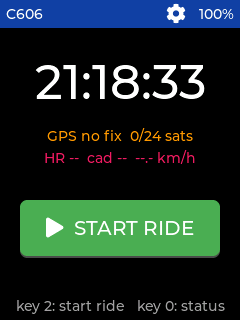
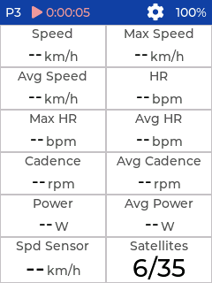
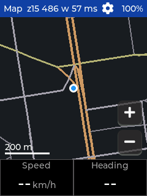
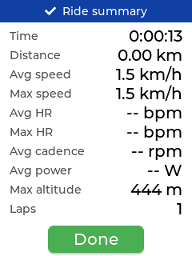

# c606-oss — open firmware for Magene bike computers

An open-source replacement firmware for the **Magene C606** GPS bike
computer, also running on the **C706** and the **Geoid CC700 Pro**. It
records rides as standard FIT files, shows configurable data pages and
offline vector maps, follows GPX routes and talks to ANT+ sensors — and
it installs next to the vendor firmware, which you can put back at any
time.

> **Status: proof of concept.** It is used on real devices, but expect
> rough edges. Flashing only replaces the app slot; the vendor
> bootloader, settings, coprocessor firmware and your data stay as they
> are.

| Idle | Data page | Map | Ride summary |
|:--:|:--:|:--:|:--:|
|  |  |  |  |

More in the [screenshot gallery](docs/SCREENSHOTS.md).

## Features

* **Ride recording** to FIT activity files — Strava, Garmin Connect, Golden
  Cheetah, … import them directly. Laps (manual and by distance), auto
  pause, ride summary and a ride history on the device.
* **Data pages**: up to 5 pages, 18 cell layouts, a field per cell — speed,
  distance, time, HR, cadence, power, altitude, gears, calories,
  zones, sunrise / sunset and more, each as current / min / max / avg.
* **Maps**: renders the Mapsforge `.map` files already on the device (or
  any official Mapsforge map), with the ridden track drawn on top.
* **Routes**: load a GPX track (or a past ride), preview its climb, ride it
  forwards or reversed, see the distance left.
* **Sensors**: ANT+ heart rate, speed, cadence, power, electronic shifting
  (SRAM AXS / eTap, Magene QED, Shimano Di2).
* **Rider profile**: calories (power → HR → speed, like the vendor), HR and
  power zones, time in zones.
* **Touch and keys**: swipe between pages, tap the gear icon for the
  settings; everything also works with the buttons.
* Dark / light theme (or automatic by sunrise / sunset), USB storage mode
  for copying maps, routes and rides.

## Supported devices

| Device | Build | Status |
|---|---|---|
| Magene C606 | `c606` (default) | verified on hardware |
| Magene C706 | `c706` | verified on hardware |
| Geoid CC700 Pro | `cc700pro` | verified on hardware (ANT+ sensors not yet checked) |
| Magene C606 Pro | `c606pro` | builds, not yet tried on a unit |

The images are not interchangeable — use the one for your device.

## Getting started

1. Get a release zip for your device (or [build one](docs/DEVELOPMENT.md)).
2. Follow [docs/FLASHING.md](docs/FLASHING.md): `pip install esptool`, run
   `flash_poc.py`. It backs up the vendor firmware first.
3. Read the [user guide](docs/USER_GUIDE.md) for the keys, pages and
   settings.

To go back: `flash_poc.py --restore backup-<date>-ota_0.bin`.

If the device ever hangs, **hold all three buttons** for a few seconds —
the coprocessor hard-resets the ESP32 whatever the firmware is doing.

## Documentation

* [Flashing](docs/FLASHING.md) — install, back up, restore
* [User guide](docs/USER_GUIDE.md) — keys, pages, fields, settings, maps, routes
* [Development](docs/DEVELOPMENT.md) — building, targets, developer console, code layout
* [Hardware notes](docs/HARDWARE.md) — reverse-engineered pin maps, protocols and vendor algorithms
* [Screenshots](docs/SCREENSHOTS.md)

## Under the hood

An ESP32-S3 runs the UI (LVGL 9) and talks to an nRF coprocessor that owns
the buttons, power and sensor radios; GPS is an Airoha receiver, storage an
on-board eMMC. Everything here was worked out from the vendor firmware —
see [HARDWARE.md](docs/HARDWARE.md).

## License

GPL-3.0-or-later, see [LICENSE](LICENSE).
