# Screenshots

Taken on the device with `tools/devcon.py … shot` (240x320).

| Idle | Status | Data page | Map |
|:--:|:--:|:--:|:--:|
| 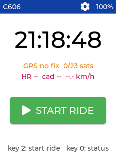 | 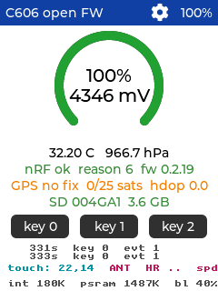 |  | 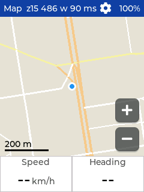 |

| Ride: page 2 | Map while riding | Lap | End ride? | Summary |
|:--:|:--:|:--:|:--:|:--:|
| 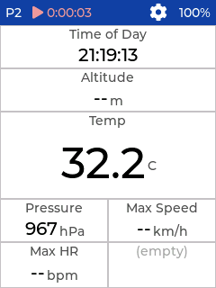 | 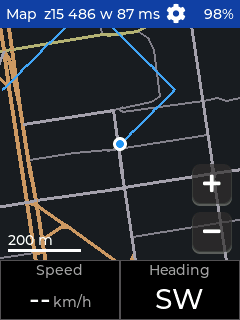 | 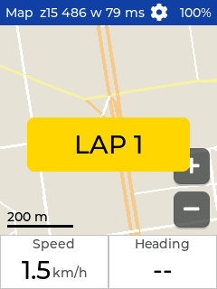 | 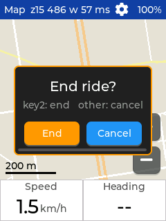 |  |

Dark theme (default):

| Idle | Status | Map z15 | Map z12 |
|:--:|:--:|:--:|:--:|
|  | 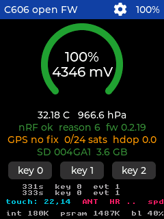 |  | 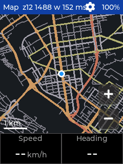 |

Settings:

| Settings | Pages | Page | Layout picker | Field editor |
|:--:|:--:|:--:|:--:|:--:|
| 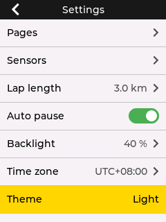 | 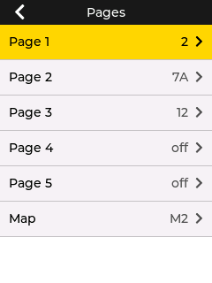 | 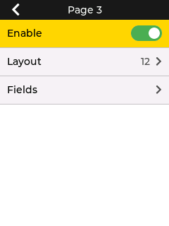 | 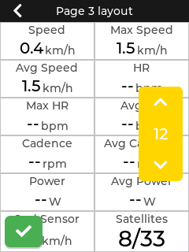 | 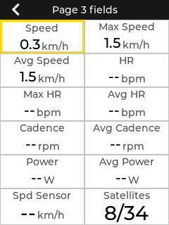 |

| Categories | Field list | Map page | Map layout | Map layers |
|:--:|:--:|:--:|:--:|:--:|
| 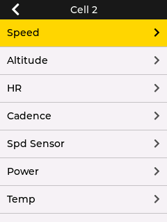 | 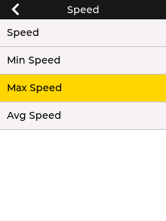 | 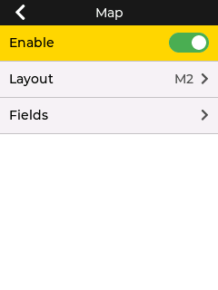 | 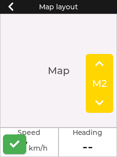 | 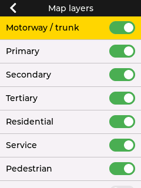 |

| Sensors | System | Settings (dark) |
|:--:|:--:|:--:|
| 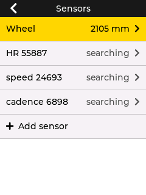 | 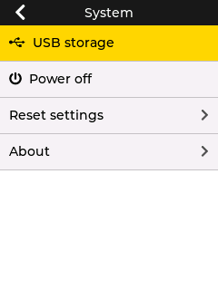 | 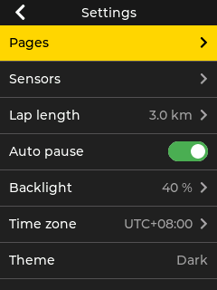 |
